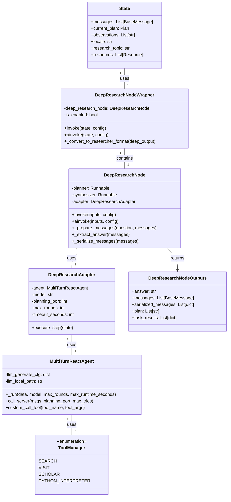
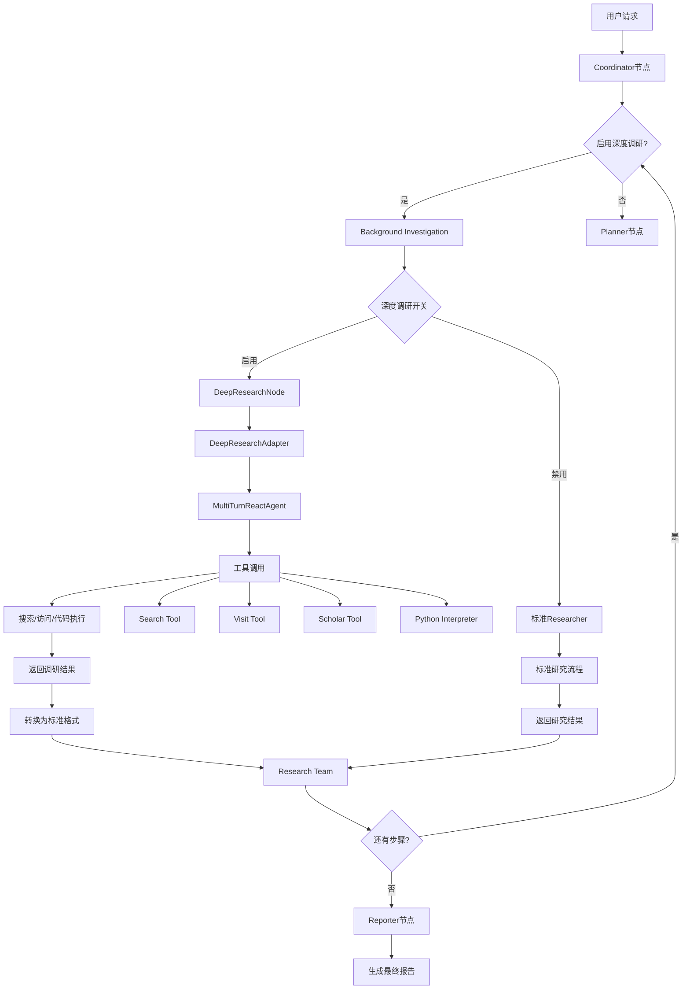
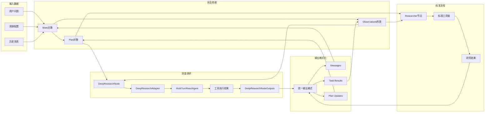

# Deer Flow 深度调研模块 PRD

## 1. 项目概述

### 1.1 背景

Deer Flow 项目当前使用多节点协作的研究架构，包含 coordinator、planner、researcher、coder、reporter 等节点。为了提升研究能力，需要集成通义千问 DeepResearch 模型的深度调研能力，实现更智能的自主研究。

### 1.2 目标

- 将 tongyi-ds 中的深度调研能力集成到 Deer Flow 主项目中
- 保持现有架构的完整性，通过可插拔方式支持深度调研
- 复用现有的搜索工具和配置，避免重复开发
- 提供灵活的开关机制，支持按需启用深度调研功能

### 1.3 核心价值

- 增强研究深度和准确性
- 提高复杂问题的解决能力
- 保持系统稳定性和向后兼容性
- 降低集成复杂度

## 2. 系统架构设计

### 2.1 类图设计



### 2.2 流程图设计



### 2.3 数据流转图



## 3. 代码目录结构

### 3.1 新增目录结构

```
src/
├── deep_research/
│   ├── __init__.py
│   ├── node.py                 # DeepResearchNode实现
│   ├── adapter.py              # DeepResearchAdapter实现
│   ├── wrapper.py              # 包装器，实现可插拔逻辑
│   ├── config.py               # 配置管理
│   ├── agent.py                # MultiTurnReactAgent适配
│   └── utils.py                # 工具函数
├── graph/
│   ├── __init__.py
│   ├── builder.py              # 修改：支持深度调研节点
│   ├── nodes.py                # 修改：添加深度调研节点逻辑
│   ├── types.py                # 扩展：新增深度调研相关类型
│   └── checkpoint.py           # 保持不变
├── config/
│   ├── __init__.py
│   ├── agents.py               # 修改：添加深度调研配置
│   ├── configuration.py        # 修改：新增深度调研开关
│   └── llm.py                  # 保持不变
├── tools/
│   ├── __init__.py
│   ├── deep_research_tools.py  # 新增：深度调研专用工具
│   └── ...                     # 现有工具保持不变
└── prompts/
    ├── __init__.py
    ├── deep_research.py        # 新增：深度调研提示词
    └── ...                     # 现有提示词保持不变
```

### 3.2 核心文件说明

#### 3.2.1 深度调研模块 (`src/deep_research/`)

- **`node.py`**: 迁移和适配 `DeepResearchNode`
- **`adapter.py`**: 实现 `DeepResearchAdapter`，连接现有工具
- **`wrapper.py`**: 包装器，实现可插拔逻辑
- **`config.py`**: 配置管理，环境变量解析
- **`agent.py`**: 适配 `MultiTurnReactAgent`
- **`utils.py`**: 工具函数和转换方法

#### 3.2.2 图构建修改 (`src/graph/`)

- **`builder.py`**: 修改图构建逻辑，支持深度调研节点
- **`nodes.py`**: 添加深度调研节点实现
- **`types.py`**: 扩展状态类型，支持深度调研相关字段

#### 3.2.3 配置扩展 (`src/config/`)

- **`agents.py`**: 添加深度调研模型配置
- **`configuration.py`**: 新增深度调研开关配置

## 4. 详细设计

### 4.1 核心组件设计

#### 4.1.1 DeepResearchNodeWrapper

```python
class DeepResearchNodeWrapper:
    """深度调研节点包装器，实现可插拔逻辑"""

    def __init__(self, deep_research_node: DeepResearchNode, is_enabled: bool):
        self.deep_research_node = deep_research_node
        self.is_enabled = is_enabled

    async def ainvoke(self, state: State, config: RunnableConfig) -> Command:
        if not self.is_enabled:
            # 回退到标准researcher节点
            return await researcher_node(state, config)

        # 使用深度调研节点
        deep_output = await self.deep_research_node.ainvoke(
            {
                "question": state.get("research_topic"),
                "messages": state.get("messages"),
                "plan": getattr(state.get("current_plan"), "steps", []),
                "task_results": state.get("task_results", [])
            },
            config
        )

        # 转换为标准格式
        return self._convert_to_researcher_format(deep_output)
```

#### 4.1.2 配置管理

```python
# 环境变量
DEEP_RESEARCHER_ENABLE=false      # 深度调研开关
DEEPRESEARCH_MODEL=alibaba/tongyi-deepresearch-30b-a3b  # 模型路径
DEEPRESEARCH_PORT=6001           # 服务端口
DEEPRESEARCH_MAX_ROUNDS=8        # 最大轮次
DEEPRESEARCH_TIMEOUT=2700        # 超时时间(秒)
DEEPRESEARCH_RETRIES=2           # 重试次数

# API配置
OPENROUTER_API_KEY=your_api_key
OPENROUTER_BASE_URL=https://openrouter.ai/api/v1
PLANNER_MODEL=openai/gpt-4o
SYNTHESIZER_MODEL=openai/gpt-4o
```

### 4.2 工具适配设计

#### 4.2.1 工具映射表

| tongyi-ds工具 | Deer Flow工具 | 功能说明 |
|-------------|---------------|---------|
| search | get_web_search_tool | 网络搜索 |
| visit | crawl_tool | 网页访问 |
| google_scholar | scholar_tool | 学术搜索 |
| PythonInterpreter | python_repl_tool | 代码执行 |

#### 4.2.2 工具适配器

```python
class ToolAdapter:
    """工具适配器，将DeepResearch工具转换为Deer Flow工具"""

    @staticmethod
    def adapt_search_tool(search_tool):
        """适配搜索工具"""
        def wrapped_search(query):
            return search_tool.invoke({"query": query})
        return wrapped_search

    @staticmethod
    def adapt_crawl_tool(crawl_tool):
        """适配爬虫工具"""
        def wrapped_crawl(url):
            return crawl_tool.invoke({"url": url})
        return wrapped_crawl
```

### 4.3 状态转换设计

#### 4.3.1 输入转换

```python
def convert_state_to_deep_format(state: State) -> dict:
    """将State转换为DeepResearchNode输入格式"""
    return {
        "question": state.get("research_topic"),
        "messages": state.get("messages", []),
        "plan": [
            {
                "title": step.title,
                "description": step.description,
                "status": "completed" if step.execution_res else "pending"
            }
            for step in getattr(state.get("current_plan"), "steps", [])
        ],
        "task_results": state.get("task_results", [])
    }
```

#### 4.3.2 输出转换

```python
def convert_deep_to_state_format(deep_output: DeepResearchNodeOutputs) -> dict:
    """将DeepResearchNode输出转换为State格式"""
    return {
        "messages": deep_output.messages,
        "observations": [deep_output.answer],
        "task_results": deep_output.task_results,
        "plan_updates": deep_output.plan
    }
```

## 5. 实现计划

### 5.1 阶段1：基础搭建（1-2天）

1. 创建 `src/deep_research/` 目录结构
2. 迁移 `DeepResearchNode` 和 `DeepResearchAdapter`
3. 实现基础配置管理
4. 创建单元测试框架

### 5.2 阶段2：工具适配（2-3天）

1. 实现工具适配器
2. 集成现有搜索工具
3. 测试工具调用兼容性
4. 优化工具调用性能

### 5.3 阶段3：节点集成（2-3天）

1. 修改 `graph/builder.py` 支持深度调研节点
2. 实现可插拔包装器
3. 集成配置开关
4. 测试节点切换逻辑

### 5.4 阶段4：API适配（1-2天）

1. 修改 `/api/chat/stream` 接口
2. 适配输出格式
3. 测试端到端流程
4. 性能优化

### 5.5 阶段5：测试和文档（1-2天）

1. 编写集成测试
2. 更新文档
3. 性能测试
4. 代码审查

## 6. 配置和使用

### 6.1 环境配置

```bash
# 启用深度调研
export DEEP_RESEARCHER_ENABLE=true

# 配置模型和服务
export DEEPRESEARCH_MODEL=alibaba/tongyi-deepresearch-30b-a3b
export DEEPRESEARCH_PORT=6001

# 配置OpenRouter（可选）
export OPENROUTER_API_KEY=your_api_key
export OPENROUTER_BASE_URL=https://openrouter.ai/api/v1
```

### 6.2 API调用示例

```python
# 标准调用
response = client.chat.completions.create(
    model="deepresearch",
    messages=[{"role": "user", "content": "研究人工智能的最新进展"}],
    stream=True
)

# 启用深度调研的调用
response = client.chat.completions.create(
    model="deepresearch",
    messages=[{"role": "user", "content": "研究人工智能的最新进展"}],
    stream=True,
    extra_body={
        "deep_research_enabled": True
    }
)
```

### 6.3 配置文件示例

```yaml
# conf.yaml.example
deep_research:
  enabled: false
  model: "alibaba/tongyi-deepresearch-30b-a3b"
  port: 6001
  max_rounds: 8
  timeout: 2700
  retries: 2

openrouter:
  api_key: "your_api_key"
  base_url: "https://openrouter.ai/api/v1"
  planner_model: "openai/gpt-4o"
  synthesizer_model: "openai/gpt-4o"
```

## 7. 测试策略

### 7.1 单元测试

- 测试 `DeepResearchNode` 基本功能
- 测试工具适配器
- 测试配置管理
- 测试状态转换

### 7.2 集成测试

- 测试节点切换逻辑
- 测试端到端流程
- 测试API适配
- 测试性能表现

### 7.3 测试命令

```bash
# 运行所有测试
uv run pytest

# 运行深度调研测试
uv run pytest tests/test_deep_research/

# 代码格式化
uv run ruff format

# 代码检查
uv run make lint
```

## 8. 风险和缓解措施

### 8.1 技术风险

- **工具调用兼容性**：充分测试，确保工具调用的一致性
- **性能影响**：设置超时和重试机制，监控性能指标
- **模型稳定性**：使用OpenRouter作为备选方案

### 8.2 集成风险

- **架构冲突**：保持向后兼容，通过开关控制功能
- **配置复杂性**：提供清晰的配置示例和文档
- **测试覆盖**：编写全面的测试用例

### 8.3 运维风险

- **资源消耗**：监控资源使用，设置合理的限制
- **错误处理**：完善错误处理和日志记录
- **回滚机制**：保留标准流程作为备选方案

## 9. 成功标准

### 9.1 功能标准

- 深度调研功能能够正常工作
- 与现有工具链完全兼容
- 支持可插拔开关机制
- API输出格式一致

### 9.2 性能标准

- 响应时间不超过标准流程的2倍
- 成功率达到95%以上
- 资源消耗在可控范围内

### 9.3 质量标准

- 代码覆盖率达到80%以上
- 通过所有集成测试
- 文档完整且易于理解

## 10. 附录

### 10.1 相关链接

- [通义千问DeepResearch文档](https://help.aliyun.com/zh/model-studio/getting-started/what-is-deepresearch)
- [Deer Flow项目文档](./README.md)
- [LangGraph文档](https://langchain-ai.github.io/langgraph/)

### 10.2 术语表

- **DeepResearchNode**: 深度调研节点
- **MultiTurnReactAgent**: 多轮反应代理
- **DeepResearchAdapter**: 深度调研适配器
- **State**: 系统状态对象
- **Plan**: 研究计划对象

### 10.3 变更历史

- v1.0: 初始版本
- v1.1: 添加工具适配器设计
- v1.2: 完善测试策略和风险控制
